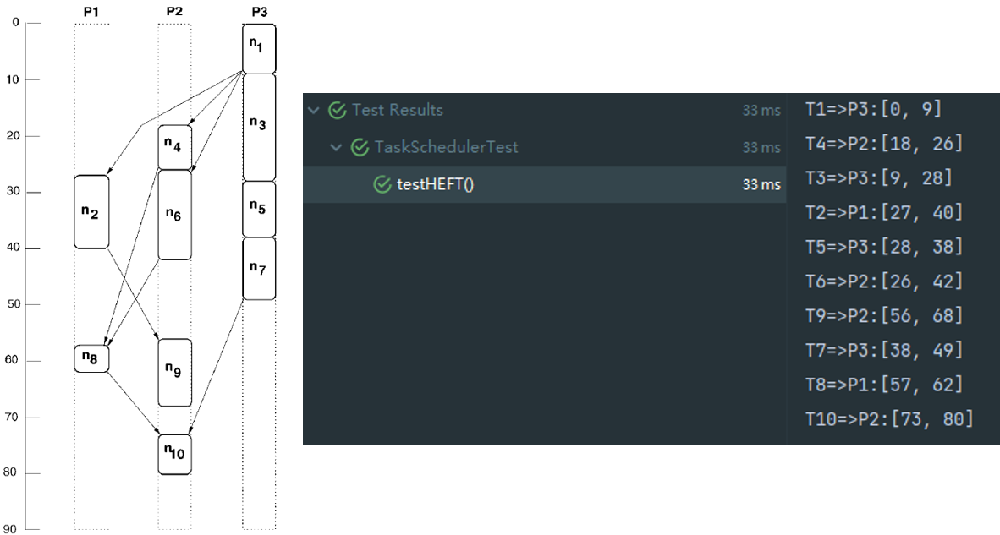
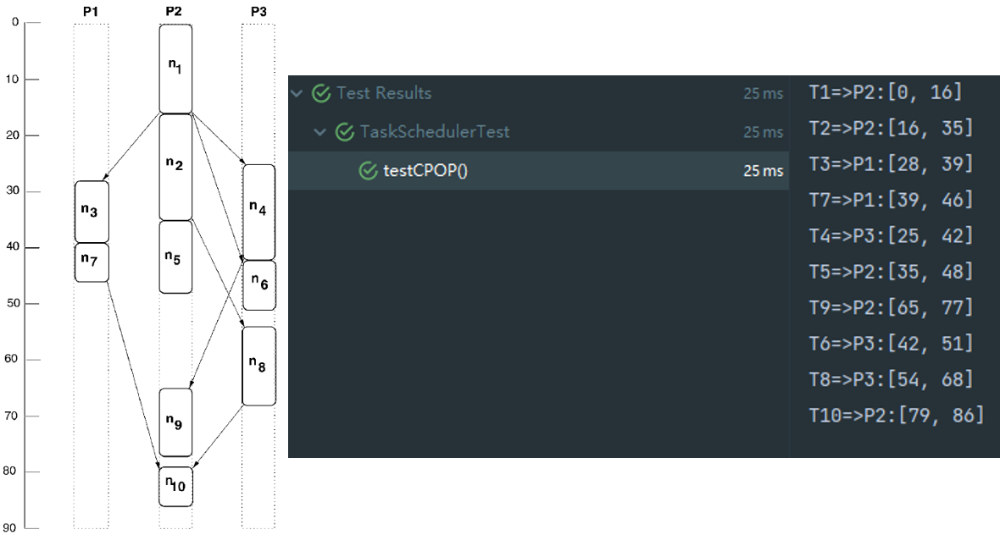

# Task Scheduling Algorithms

> Implementations of HEFT and CPOP, which are scheduling algorithms proposed by the paper "*[Performance-effective and low-complexity task scheduling for heterogeneous computing](https://ieeexplore.ieee.org/document/993206)*".


[Here are sample tests of HEFT and CPOP.](https://github.com/Morgan279/LowComplexityTaskScheduling/blob/master/src/test/java/edu/ecnu/wclong/algorithm/TaskSchedulerTest.java)


### HEFT

```java
    @Test
    public void testHEFT() {
        TaskGraph taskGraph = TestDataGenerator.generateTestTaskGraph();
        TaskScheduler taskScheduler = new HEFT(TestDataGenerator.TASK_NUM, TestDataGenerator.PROCESSOR_NUM);
        String[] rightSchedules = {"T1=>P3:[0, 9]", "T4=>P2:[18, 26]", "T3=>P3:[9, 28]", "T2=>P1:[27, 40]", "T5=>P3:[28, 38]", "T6=>P2:[26, 42]", "T9=>P2:[56, 68]", "T7=>P3:[38, 49]", "T8=>P1:[57, 62]", "T10=>P2:[73, 80]"};
        List<Schedule> schedulesResult = taskScheduler.schedule(taskGraph);
        for (int i = 0; i < TestDataGenerator.TASK_NUM; ++i) {
            Schedule schedule = schedulesResult.get(i);
            Assertions.assertEquals(rightSchedules[i], schedule.toString());
            System.out.println(schedule);
        }
    }
```

Test result:




### CPOP

```java
    @Test
    public void testCPOP() {
        TaskGraph taskGraph = TestDataGenerator.generateTestTaskGraph();
        TaskScheduler taskScheduler = new CPOP(TestDataGenerator.TASK_NUM, TestDataGenerator.PROCESSOR_NUM);
        String[] rightSchedules = {"T1=>P2:[0, 16]", "T2=>P2:[16, 35]", "T3=>P1:[28, 39]", "T7=>P1:[39, 46]", "T4=>P3:[25, 42]", "T5=>P2:[35, 48]", "T9=>P2:[65, 77]", "T6=>P3:[42, 51]", "T8=>P3:[54, 68]", "T10=>P2:[79, 86]"};
        List<Schedule> schedulesResult = taskScheduler.schedule(taskGraph);
        for (int i = 0; i < TestDataGenerator.TASK_NUM; ++i) {
            Schedule schedule = schedulesResult.get(i);
            Assertions.assertEquals(rightSchedules[i], schedule.toString());
            System.out.println(schedule);
        }
    }
```


Test result:




------

If it may be helpful for you, you could give me a star to support me.
